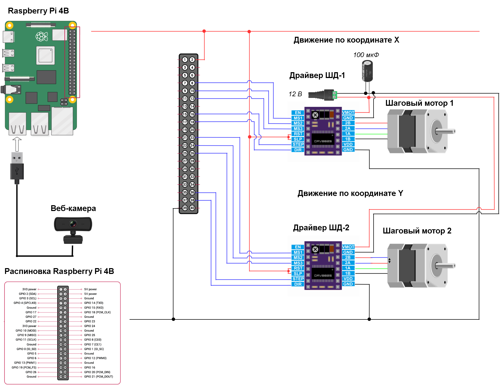
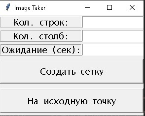
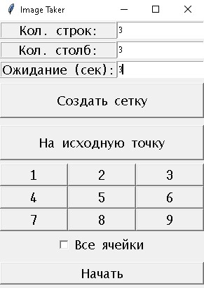
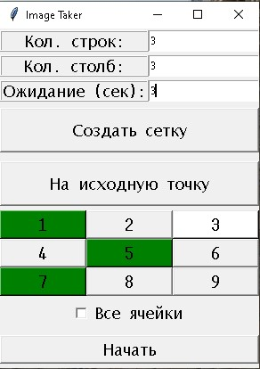
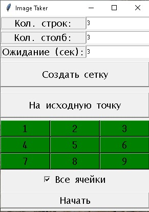

# Plant Picking Module

### Description of the System  

<table>
  <tr>
    <td align="center">
       
      Equipment connection
    </td>
  </tr>

  <tr>
    <td align="center">
       
      Initail view
    </td>
    <td align="center">
       
      Cells creation
    </td>
  </tr>
    <td align="center">
       
      Selecting certain cells
    </td>
    <td align="center">
       
      Selecting all cells
    </td>
  </tr>

</table>

### Testing  

<table>

  <tr>
    <td align="center">
       
      Selecting certain cells
    </td>
    <td align="center">
       
      Selecting all cells
    </td>
  </tr>

</table>

